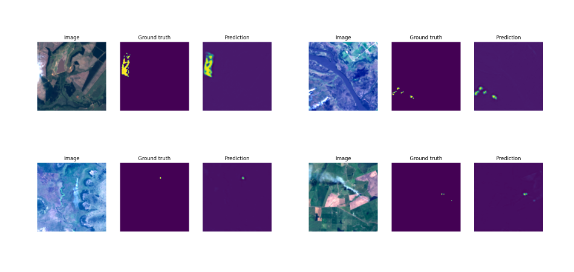

### Pixel-wise Active Fire Classification in Landsat-8 using Deep Learning 
This repository contains the code to perform supervised classification of active fire pixels from Landsat-8 images.  

### Requirements
Please see `requirements.txt`

### Usage
- `dataset.py:` contains the ActiveFire dataset instance
- `inference.py`: runs inference on the test set and saves the results 
- `main.py`: runs training
- `model.py`: defines the model
- `trainer.py`: defines the train/val/test loops

Simply download the dataset, and accordingly revise the paths in `main.py`.

### Dataset
The dataset used in this study: [Active fire detection in Landsat-8 imagery: A large-scale dataset and a deep-learning study](https://www.sciencedirect.com/science/article/pii/S092427162100160X)

### Sample Results
 
